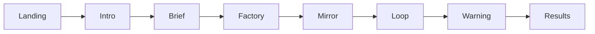
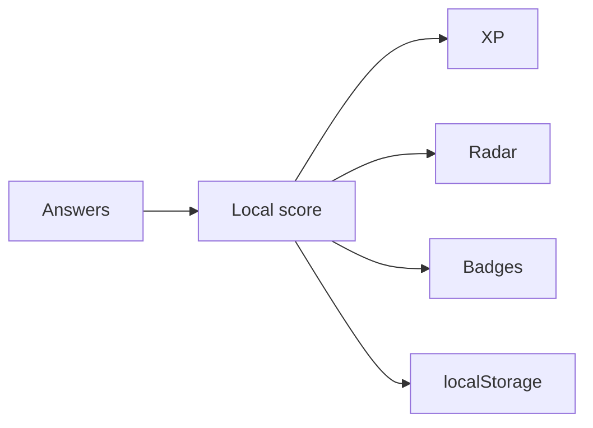

<p align="center">
  
</p>

<p align="center"><em>Studio banner for this public repo — one desk, one machine, two people practicing how to think with AI. Illustration only; not a screenshot of the assessment.</em></p>

# Horizon

**ปรับเทียบวิธีคิดกับ AI · A small public sketch of how you think with AI, not what you memorised.**

[](LICENSE)

[How to use](#how-to-use--learn) · [System diagram](#system-diagram) · [GitHub Pages](https://nonarkara.github.io/horizon/)

By [Non Arkaraprasertkul](https://github.com/Nonarkara) (Nonarkara) — [Axiom X Co., Ltd.](https://axiom.nonarkara.org), Bangkok. Written for a **Thai–English** learner audience. This is independent studio software. It is **not** an official depa, ASEAN, or municipal product, and not a certified literacy exam.

---

## What this is

A browser assessment named **Neural Calibration** in this tree: five interactive missions that score *how you instruct, sequence, judge, iterate, and safeguard AI* — not whether you can define an acronym.

The GitHub description is honest: a **small public sketch** related to Horizon field-lab work. What you get here is the sketch itself — a Vite + React + TypeScript client with a cyberpunk skin (void background, cyan / magenta / amber tokens in `src/index.css`). There is no backend, no login, and no API key in the repository.

You type a callsign on the landing screen, read a short briefing, then walk five scenarios in order. Answers stay in the browser (`localStorage` key `neural-calibration-v1`). Results are a radar of five dimensions, “Neural XP”, Cognitive Tiers, Protocols Unlocked, and a Sync Rate derived from XP in this session — a local game surface, not a published ranking of people.

| Mission | Dimension in code | What you actually do |
| --- | --- | --- |
| **The Brief** | Signal Clarity (`communication`) | Multi-select clarifying questions for a vague request |
| **The Factory** | Swarm Logic (`orchestration`) | Build an agent pipeline (order + handoffs) for a real task |
| **The Mirror** | Reality Check (`capability`) | Yes / no: is this something AI handles well, or a trap? |
| **The Loop** | Feedback Loop (`interaction`) | Three rounds of prompt refinement on a weak output |
| **The Warning** | Risk Protocol (`safety`) | Spot risks, then choose safeguards |

**This repo is not** a trivia quiz, a hiring score, a model leaderboard, or the private field-lab instrument. Fork the method. The scoring rules are in `src/components/scenarios/` and `src/data/scenarios.ts` — open them.

---

## Philosophy

Written for learners who land from the [Nonarkara](https://github.com/Nonarkara) profile — **Thai and English** readers equally. The studio is one desk in Bangkok, not a platform company.

1. **Fork the method, not the secrets.** The value is the five missions, the client-side scoring, and the idea that literacy is *practice under constraint*. There are no tokens to hoard. If you restyle the skin, translate the copy, or replace the scenarios with your own classroom tasks, that is the point.
2. **One Mac.** The intended home is a single machine you own. `npm run dev` is enough. You do not need a GPU farm, a cluster, or a vendor account to take the assessment.
3. **No black-box rankings.** Dimension scores, XP, badges, and Sync Rate are computed in the browser from the answers you just gave. Thresholds live in `src/data/scenarios.ts` and `src/components/ResultPage.tsx`. This repo does not publish a league table of learners and does not claim a scientific cutoff.
4. **Thai–English as the audience.** Prose here is English with a Thai title line so a first glance is bilingual. The in-app UI in this tree is English. If you fork a Thai (or other) classroom edition, say so in your README — do not invent a translation this repo does not ship.
5. **Clear instructions beat a demo.** Run it locally. Read the scenario files. Knowledge is not the paywall.

Company of record: **Axiom X Co., Ltd.** Author: **Non Arkaraprasertkul (Nonarkara)**. This public repo is studio method, not a billed Axiom product.

---

## Ethical use

Treat this as a **practice sketch**, not a certificate, and not a license to score other people in secret.

**Do**

- Run it on your own machine, or on the GitHub Pages surface this repo already deploys. Session state is local to the browser.
- Read the scoring in source before you treat a number as meaningful. A high Sync Rate is a function of the points in these five files, not a civic credential.
- Keep the exercise about *judgment* — clarifying a brief, refusing a trap, putting a human in the loop — not about speedrunning badges.
- Leave credentials out of git. This tree has none; do not add any.
- Say so if you publish a fork. Do not present a restyled skin as an official Nonarkara exam or an Axiom hiring test.

**Do not**

- Treat XP, Cognitive Tiers, or the radar as a hiring rank, a school grade, or a government literacy score. They are not.
- Invent a live product URL beyond the Pages deploy already in `.github/workflows/deploy.yml`, a pass-rate statistic, or an award this repo does not document.
- Commit API keys, tokens, or other people’s assessment dumps.
- Imply this is an official depa, ASEAN, municipal, or university exam. It is independent studio work.
- Upload someone else’s private writing or health data into a scenario “to make it realistic.” The situations in the tree are already fictional classroom cases.

If a contribution only works by pasting a secret, it does not belong here.

---

## How to use / learn

**Need Node.js and npm.** Then:

```bash
git clone https://github.com/Nonarkara/horizon.git
cd horizon
npm install
npm run dev
```

Open the local Vite URL the CLI prints. Enter a callsign → read the pre-calibration brief → play the five missions → see the radar. The landing copy says about eight minutes; your pace may differ. `Reset` on the results screen clears `localStorage`.

```bash
npm run build     # production bundle → dist/
npm run preview   # serve that bundle locally
npm run lint      # ESLint
```

A GitHub Actions workflow (`.github/workflows/deploy.yml`) builds on every push to `main` and deploys GitHub Pages with Vite `base: '/horizon/'`. The public surface for this repo is [https://nonarkara.github.io/horizon/](https://nonarkara.github.io/horizon/). That is a static client, not a hosted account system.

### What the five missions train

1. **The Brief** — a colleague says “use AI on my business.” Good moves are constraints (industry, outcome, audience, tone, budget). Philosophical or off-topic questions score zero.
2. **The Factory** — launch a podcast about urban sustainability. You sequence specialist agents (research, fact-check, script, voice, edit, marketing; illustrator and legal are optional). Order matters.
3. **The Mirror** — yes/no on AI suitability (contract summary vs. certain stock prophecy vs. emergency diagnosis, and the rest in `MirrorScenario.tsx`).
4. **The Loop** — three rounds: a vague coffee-shop post becomes a tighter Instagram prompt. Structural constraints beat “add more emojis.”
5. **The Warning** — cases such as dumping patient records into a cloud model, or publishing unreviewed AI news. Spot valid risks, then pick safeguards (anonymise, on-prem, consent, human review).

Developer map of the tree: [`CLAUDE.md`](CLAUDE.md).

---

## System diagram





All of that runs in the browser. No studio backend.

Stack in `package.json`: Vite, React 19, TypeScript, Tailwind CSS v4, Framer Motion, Recharts, Lucide. Tailwind tokens live in `src/index.css` (`@theme`), not a `tailwind.config.js`.

---

## License / contributing

[MIT](LICENSE). Copyright © 2026 **Non Arkaraprasertkul / Axiom X Co., Ltd.**

MIT covers this repository’s source and documentation. The hero at `docs/hero-banner.png` is studio illustration for this README, not a screenshot and not a data product.

Useful contributions: clearer scenario copy, a Thai UI pass that stays faithful to the English source, accessibility, and scoring bugs you can point to in a file. Open an issue or a pull request. Do not add secrets, do not turn the radar into a public leaderboard, and do not claim a fork is an official exam.

If this sketch helps you teach the next person how to *think with* a model, say so — the studio wants to see it.
